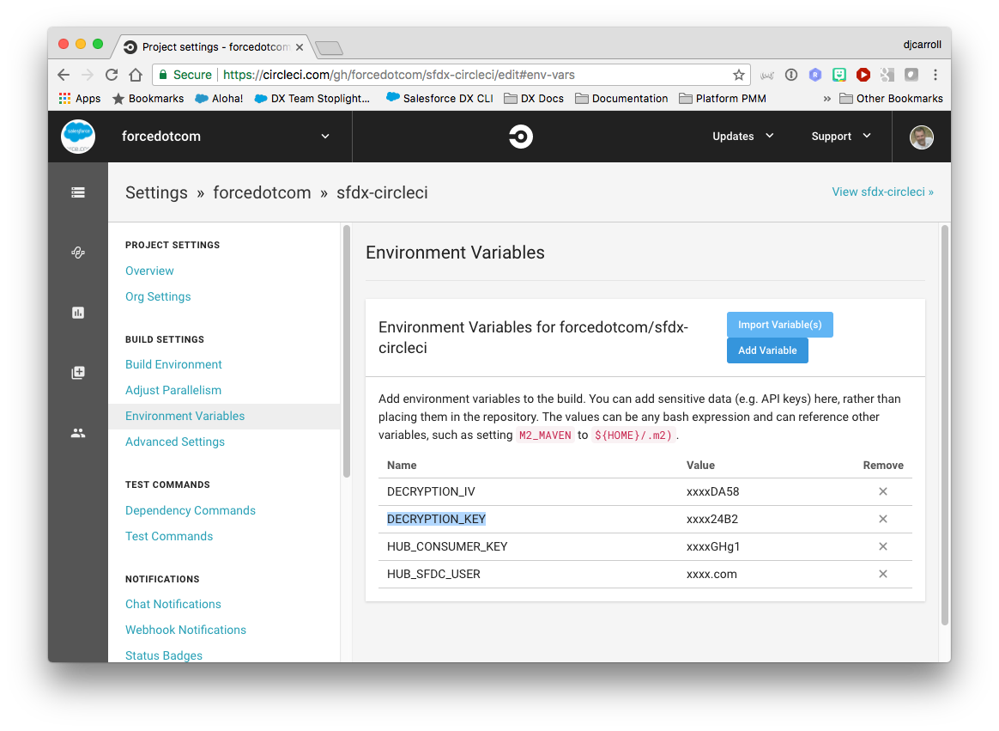

# BuildMyBox - createscratchorg

This contains the components and data that will be deployed to the scratch Orgs while creation through [Buildmybox App](http://www.buildmy-box.com/).

Make sure to complete all the manual steps mentioned in the [Buildmybox site](http://www.buildmy-box.com/) for this repository to work.

## Getting Started

1) [Fork](http://help.github.com/fork-a-repo/) this repo into your github account using the fork link at the top of the page.

2) Clone your forked repo locally: `git clone https://github.com/<git_username>/sfdx-circleci.git`

3) From you JWT-Based connected app on Salesforce, retrieve the generated `Consumer Key` and store in a Circleci environment variable named `HUB_CONSUMER_KEY` using the Circleci UI.

4) Store the user name that you use to access your Dev Hub in a Circleci environment variable named `HUB_SFDX_USER` using the Circleci UI. Note that this username is the username that you use to access your Dev Hub.

5) Store the `key` and `iv` values used above in Circleci environment variables named `DECRYPTION_KEY` and `DECRYPTION_IV` respectively.  When finished setting environment variables you environment variables setup screen should look like the one below.

6) IMPORTANT! Remove your `server.key`: `rm assets/server.key`, you should never store keys or certificates in a public place.

Now when you commit and push a change, your change will kick off a Circle CI build.

## Team ###

<table>
    <tr>
        <td width="200px"> </td>
        <td> Anil Shivaraj Specialist Master (Customer & M, NY office)   Salesforce certified architect with 17+ salesforce certifications and extensive background in analytics and mobile platform. Worked with leading clients in Pharma and Insurance sector, leading multiple salesforce projects involving Devops and Agile delivery   Email : ashivaraj@deloitte.com</td>
    <tr>
        <td width="200px"></td>
        <td>Jaswinder Singh Consultant (Customer & M, Bengaluru office)   Salesforce certified developer with 4.5 years of IT experience in salesforce. Worked extensively on Agile based sales and service cloud projects involving complex integrations. Experienced in both classic and Lightning development.   Email : jaswinsingh@deloitte.com</td>
    </tr>
</table>
