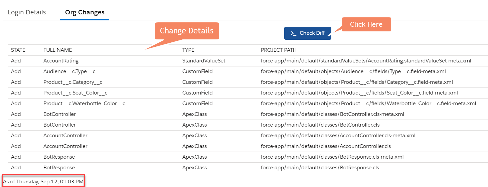

# BuildMyBox - diffcheck

The [Buildmybox App](http://www.buildmy-box.com/) includes various functionalities, one of them is to fetch the changes made in the scratch org and store in the `Request Scratch Org` record in the app related to that scratch org.

This branch includes th logic for the **Difference Check** functionality.

### Check Difference Functionality

- Open **Buildmybox App** in salesforce and go the `Request Scratch Org` record related to the scratch org where you made changes.

- Go to the `Org Changes` section and click on 'Check Diff' button. The CI job for checking the difference will run and the changes will be tracked in the `Org Changes` section of the same record.

